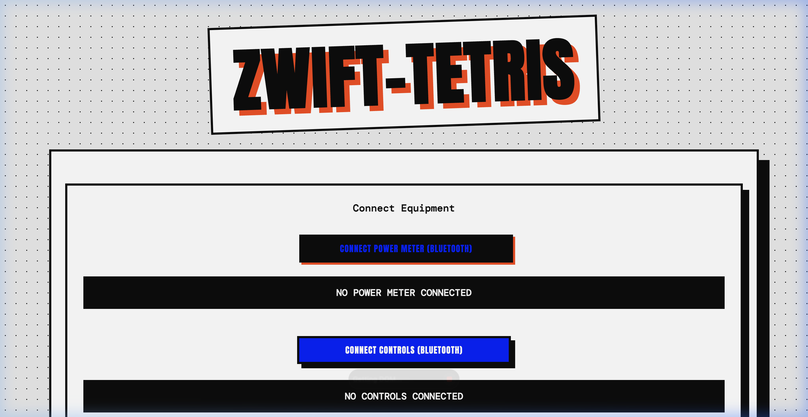

# 🚴 Zwift-Tetris

**Play Tetris while you ride.** Connect your Zwift smart trainer and controllers via Bluetooth and play a fully functional Tetris game — controlled by your cycling power and Zwift Click/Play buttons.

<p align="center">
  
</p>

---

## What Is This?

Zwift-Tetris is a browser-based Tetris game designed to be played on a second screen during indoor cycling sessions. It connects directly to your cycling equipment over **Web Bluetooth**:

- **Power Meter** — Your real-time wattage controls the speed of the game. Pedal harder and the blocks fall slower, giving you more time. Stop pedaling and the blocks rain down as punishment.
- **Zwift Click / Play Controllers** — Use your handlebar-mounted Zwift buttons to move, rotate, drop, and hold pieces without taking your hands off the bars.

It's a zero-install, single-file PWA that runs entirely in your browser.

---

## Features

| Feature | Description |
|---|---|
| **🔌 BLE Power Meter** | Connects to any Bluetooth cycling power meter. Your wattage dynamically controls game speed. |
| **🎮 Zwift Click / Play** | Full button mapping for Zwift's BLE controllers — move, rotate, hard drop, and hold pieces. |
| **⌨️ Keyboard Controls** | Also playable with arrow keys, Shift/C for hold, and Space/A for hard drop. |
| **⚡ Dynamic Difficulty** | Below 75W? Blocks speed up dramatically. Above 75W? The harder you pedal, the easier it gets. |
| **🏆 Local Leaderboard** | Saves top 10 scores to `localStorage`. Compete against yourself (or your riding buddies). |
| **📱 PWA / Installable** | Can be installed as a standalone app on any device via the browser's "Add to Home Screen". |
| **💥 Particle Effects** | Line clears trigger particle explosions and floating score text. |

---

## How to Play

### 1. Open the Game
Serve the files locally or host them anywhere:
```bash
# Quick local server
python3 -m http.server 8080
```
Then open `http://localhost:8080` in **Chrome** or **Edge** (required for Web Bluetooth).

### 2. Connect Your Equipment (Optional)
- Click **Connect Power Meter** to pair your BLE power meter.
- Click **Connect Controls** to pair your Zwift Click v2 or Zwift Play controllers.

> **Note:** Your devices must not be simultaneously connected to the Zwift app — BLE only allows one active connection at a time.

### 3. Play!
Hit **Play Now** and start pedaling. The game responds to your power output in real time.

---

## Controls

### Keyboard
| Key | Action |
|---|---|
| ← → | Move left / right |
| ↑ | Rotate |
| ↓ | Soft drop |
| Space / A | Hard drop |
| Shift / C | Hold piece |

### Zwift Click / Play
| Button | Action |
|---|---|
| Left / Right | Move |
| Up / Shift Up | Rotate |
| Down / Shift Down | Soft drop |
| A Button | Hard drop |
| B Button / Power-Up | Hold piece |

---

## Tech Stack

- **HTML / CSS / JS** — Single-file, zero dependencies
- **Web Bluetooth API** — Direct BLE communication with cycling hardware
- **Canvas 2D** — Game rendering with particle effects
- **PWA** — Service worker + manifest for installability

---

## Requirements

- A browser that supports **Web Bluetooth** (Chrome, Edge, Opera)
- A Bluetooth cycling power meter *(optional, for dynamic speed)*
- Zwift Click v2 or Zwift Play controllers *(optional, for handlebar controls)*

---

## License

MIT
